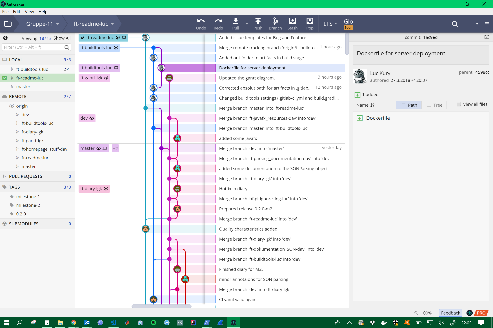

# Contributing
This document is intended to give you guideline on how to contribute to this repository.

## Tools
### GitKraken
[https://www.gitkraken.com/](https://www.gitkraken.com/)




### git-flow
[https://github.com/nvie/gitflow](https://github.com/nvie/gitflow), [https://www.atlassian.com/git/tutorials/comparing-workflows/gitflow-workflow](https://www.atlassian.com/git/tutorials/comparing-workflows/gitflow-workflow), [https://support.gitkraken.com/git-workflows-and-extensions/git-flow](https://support.gitkraken.com/git-workflows-and-extensions/git-flow)


## Workflow
1. Configure your local git installation by entering the following commands into your command line:
(Careful: Don't use the ``--global`` flag if you have an existing git installation. Change into the project directory and run the commands **without** ``--global``.)  
```sh
$ git config --global user.name "User Name - shortname00"
$ git config --global user.email "your.email@stud.unibas.ch"
$ git config --global core.autocrlf true
```
2. Make sure to checkout the most recent ``dev`` branch.
3. Create a new feature/bugfix/hotfix branch to commit your changes. Your branch names have to adhere to the gitflow conventions.
3.1 Open an issue for the feature you are working on, and tag it with the ``doing`` label.
4. Use GitKraken to stage you changes, commit and push your code to remote. 
4.1 To push your commits to gitlab via Git-Bash, you need to perform the following steps:  
```sh
--> via ssh: Connect Cisco VPN (ssh key based auth)
$ eval $(ssh-agent -s)
$ ssh-add /c/users/$(whoami)/.ssh/id_rsa
--> via https: none (credential based auth [https://stackoverflow.com/a/5343146](https://stackoverflow.com/a/5343146))
$ git push ...  
```
5. On ``git.scicore.unibas.ch`` create a pull request to the ``dev`` branch. Assign someone to review your changes.


## Branch name
(taken from [https://nvie.com/posts/a-successful-git-branching-model/](https://nvie.com/posts/a-successful-git-branching-model/))

| Branch type            | Prefix          |
| --------------- | ------------- |
| Master  | master  |
| Develop  | dev  |
| Releases  | release/  |
| Features  | feature/  |
| Hotfixes  | hotfix/  |


## Versioning
(taken from [https://semver.org/](https://semver.org/))

Given a version number MAJOR.MINOR.PATCH, increment the:
1. MAJOR version when you make incompatible API changes,
2. MINOR version when you add functionality in a backwards-compatible manner, and
3. PATCH version when you make backwards-compatible bug fixes.
Additional labels for pre-release and build metadata are available as extensions to the MAJOR.MINOR.PATCH format.

