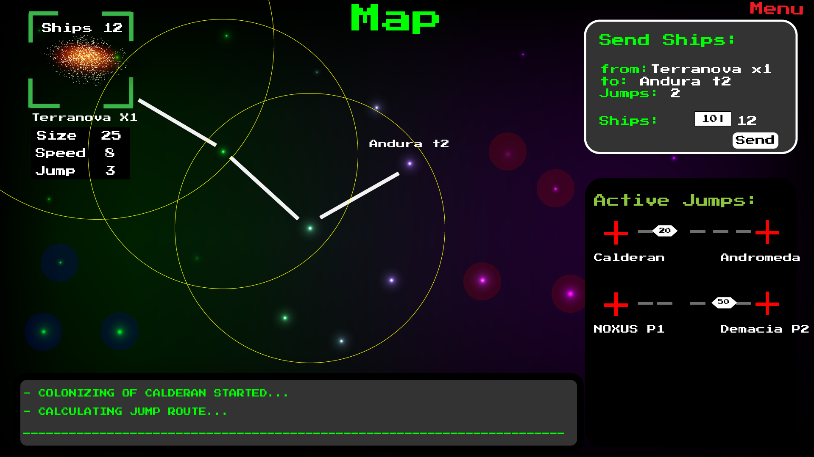
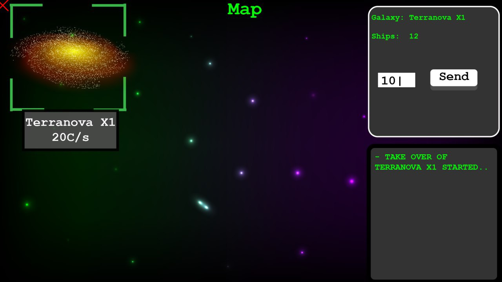

**Table of Contents**  
[1. Overview](#1-overview)  
[2. Getting Started](#2-getting-started)  
[3. Game Concept](#3-game-concept)  
[4. License](#4-license)  
[5. Webpage](#5-webpage)

# [Subluminal](https://en.wiktionary.org/wiki/subluminal) /ˌsʌbˈl(j)uːmɪnl/ - The Game
[](http://subluminal.tech) **by Bordeaux Ink.**

> Once upon a time a clever programmer named Bob created in the basement of his mom's house 4 different AIs. Throughout his whole life Bob tried to get the AIs to work together, but sadly he never achieved his this goal. After Bob passed away the world forgot about him and his work. But the AI's never forgot, ever single one of them evolve and adopted, with the goal to be the best AI in the whole universe ...  


## 1. Overview
### Basic Usage:
Download the current jar bundle (Subluminal-0.2.0-m2.jar) or clone the repo and run ``gradle build`` (output in ``./app/build/libs/``).  Start the game with the following command:  
```sh
# First start a server.
java -jar Subluminal-0.2.0-m2.jar server <port>
# Then start the clients.
java -jar Subluminal-0.2.0-m2.jar client <hostaddress>:<port> [<username>]
```
On the client you can use ***/changename*** to change your username and ***/logout*** to exit the client.


## 2. Getting Started
1. Generate a pair of ssh keys and add them to your gitlab account (follow [these instructions](https://git.scicore.unibas.ch/help/ssh/README#generating-a-new-ssh-key-pair) or run  
``ssh-keygen -t rsa -C "your.email@stud.unibas.ch" -b 4096``)
3. Clone the repo to your hard drive ``git clone https://git.scicore.unibas.ch/CS108-FS18/Gruppe-11.git``  
4. cd into the project directory and try to build the project with ``./gradlew build`` (on Unix) or ``gradlew.bat build`` (on Windows).
5. A more specific document on code quality assurance is located in [docs/quality_assurance.md](docs/quality_assurance.md) and [CONTRIBUTING.md](CONTRIBUTING.md).


## 3. Game Concept
You can find a detailed description on how the game is played, in [docs/game_rules.md](docs/game_rules.md) folder.  


  


## 4. License
  
**GNU AGPLv3**. [https://choosealicense.com/licenses/agpl-3.0/]()


## 5. Web
[subluminal.tech](http://subluminal.tech)  /   [merch.subluminal.tech](http://merch.subluminal.tech)  /   [buy.subluminal.tech](http://buy.subluminal.tech)