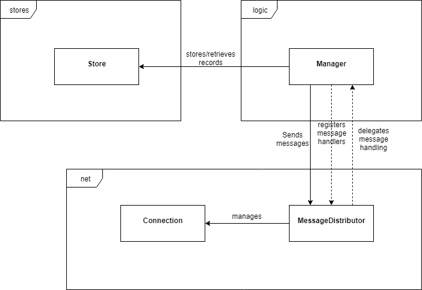
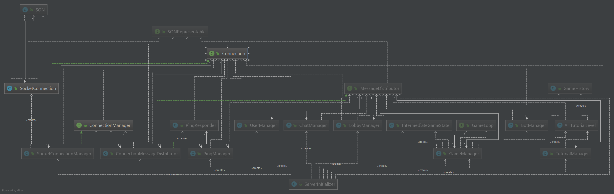
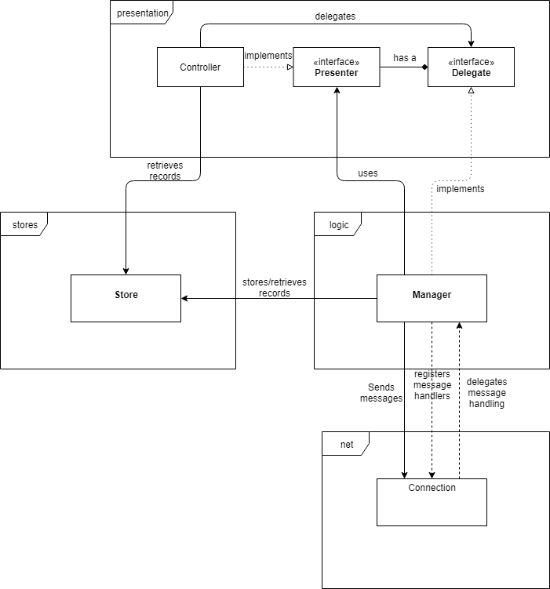
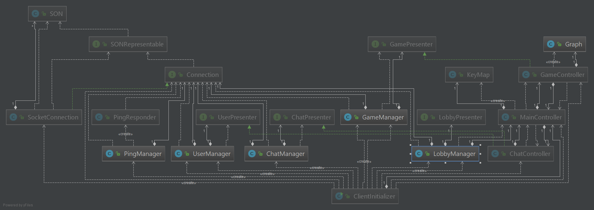
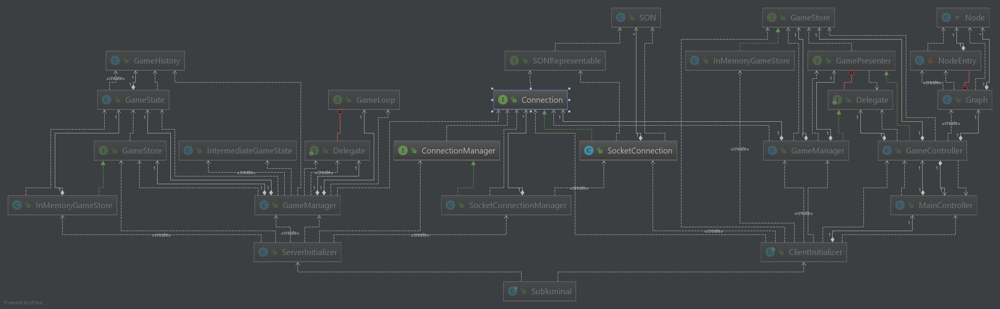

# Program Architecture
Due to the rather complex nature of our project (over 200 classes), we deemed it unfeasable to create a single UML diagram containing all classes. Instead, we decided to illustrate the architecture of our project the following way:  
We picked the most important and relevant classes from the client package as well as from the server package and constructed separate UML diagrams for both to show the most important dependencies within the packages. Additionally, we illustrated the most crucial interactions between client and server in a third UML diagram called ``Game``, as you see below.  
For the client and the server, we also drew a rudimentary overview of the basic concept behind our architecture. 

## Server

The diagram above shows three main packages of the server (aside from the init package, which puts together all the classes and serves as an entry point for the server). The managers, which reside in the ``logic`` package, can access classes in both the ``stores`` and the ``net`` package, as opposed to the classes in the ``net`` package, which can only access the logic package through handlers that the managers register with. The ``net`` package is the interface through which client and server communicate over the internet.  
For more detailed information about the server structure, see the UML diagram below:

The diagram above contains all the managers from the logic package, as well as some supporting classes, like ``GameHistory``. The ``SON`` and ``SONRepresentable`` classes, which realize our [SON protocol](../network_protocol.md), are used and implemented many times over in the ``logic`` and ``net`` package. Missing on this diagram is the ``stores`` package, which would not add a lot of information to the diagram but make it significantly harder to read.

## Client

For the most part, the ``stores``, ``logic`` and ``net`` packages interact the same way as in the server, the only difference being that the network package only contains a single connection, and thus, doesn't need a distributor. Additionally, the client adds another package, namely the ``presentation`` package. The presentation package contains controllers, as well as custom components which are not depicted in this diagram. Like the manager, the controllers can directly access the ``stores`` package. The controllers expose themselves to the manager through interfaces that are defined inside the ``presentation`` package. These ``Presenter`` interfaces define ``Delegate``s, which are implemented by the manager and used to send user input to the ``logic`` package.  
For more detailed information about the client structure, see the UML diagram below:

Much like the UML diagram of the server, this diagram above shows exactly which managers exist in the ``logic`` package. Additionally to the entire ``stores`` package, we also left out the controllers and custom elements from the ``presentation`` package, opting instead to only depict the ``Presenter`` interfaces which the controllers implement.

## Game
In the detailed diagram of the classes involved in game logic, you can see how the main class ``Subluminal`` kickstarts the initialization of the program, which takes place in the client or server initializer. You can also see how conretely the ``GameManager`` on both the client and server side, are related to other important classes. In the center of the diagram you can see how the network classes, together with our ``SON`` protocol, enable communication between client and server.
  

## Closing remarks
It is clearly visible that dependencies between our classes are rather hierarchical, with very few closed loops to be found. We also do have many util classes and functions, as well as a class for every single network message (``SONRepresentable``), which we didn't inlcude in any of the diagrams as they would add no information on the structure of our code, but make the diagrams impossible to read.
