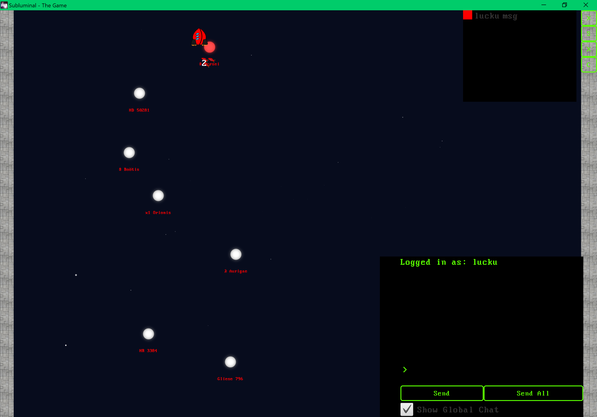
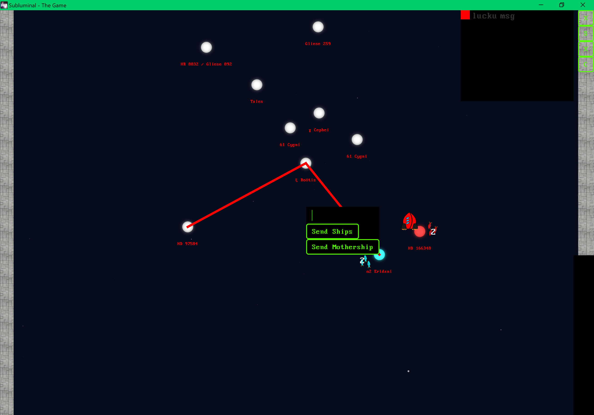

# How to play
In the following sections we are going to teach you how to play the game. You are going to learn how to start the server and client and also how you actually win a round. So lets begin ...

## Preparation
Before we can play the game, you need to prepare your environment. The minimal requirements to play Subluminal are the following:

| Specification             | Server               | Client               |
| :------------------------ | :------------------- | :------------------- |
| Hardware:                 | *                    | *                    |
| *CPU:*                    | 2 *GHz* (DualCore)   | 2 *Ghz* (DualCore)   |
| *RAM:*                    | 1 *GB*               | 4 *GB*               |
| *Harddisk:*               | 500 *MB*             | 500 *MB*             |
| *Network:*                | 1 *Mbit/s*           | 100 *kbit/s*         |
| Software:                 | *                    | *                    |
| *Java SE:*                | Version 8 Update 171 | Version 8 Update 171 |
| *Docker CE: (optional)*   | 18.03.1-ce           | -                    |

### Starting the server
In order to play Subluminal, the first thing you need is a server. There are two basic ways you can a server up and running:
1. Download the jar file from our [website](https://subluminal.tech/#download) and start the server locally or on a remote host with the command ``java -jar Subluminal-5.0.0.jar server 1729``.
2. If you are using docker, we have an image prepared for you on [docker hub](https://hub.docker.com/r/subluminalthegame/subluminal-server/). You can use the following command to launch the container ``docker run -d -v $PWD/mods:/opt/lib/subluminal/mods -restart=always subluminalthegame/subluminal-server:5.0.0``.

### Launching the client
So now that our server is up and running, you can start the client and connect to it. Do this from the console with the command ``java -jar Subluminal-5.0.0.jar client localhost:1729``. You should now be presented with the following view:

You are now in the main menu of the game. From here you can do the following things by pressing the different buttons:
- **Play**: Create, join and view game lobbies.
- **Highscores**: See the highscores on this server.
- **Settings**: Change client related game settings, i.e. audio, etc.
- **P**: See a list of all players connected to the server.
- **C**: Change your in-game name.
- **S**: Shortcut to settings menu (global).
- ***Chat***: The chat is hidden by default and will apear by clicking on its left border or when a whisper message is received. There are three channels you can send and receive messages: global, game, personal (whisper).
  - ***global***: Everybody on the server can see the message (*default* when not in a lobby or game).
  - ***game***: Only the players in the same game or lobby can see the message (*default* when in a game or lobby).
  - ***personal*** (whisper): Only the person whispered to will see the message (prepend @\<username\> to message).

## New game
By clicking on the play button, you are taken to the lobby menu. You should be presented with the following view: 
Chances are, no game or lobby exists on the server yet. You can use the \<**Create Lobby**\> button to create a new one. You will be automatically joined into the waiting room and given the status of admin. Use the \<**Start Game**\> button to launch the game once all players have joined and are ready.
If there is an existing lobby/game on the server, you can join it by pressing on the **join** label. Now you need to wait for the admin to start the game.

### Start
After the map has loaded, you can see the star map. You use this view to control the movement of your ships. Your start position is indicated with an arrow (see figure below). 

This is also where you find your mothership. It will automatically start to capture the star. This is indicated by a change of color. The star slowly star filling form the inside. As soon as it is captured fully, the star will start to produce fleet units at a fixed rate. The amount of fleet units present on a star is shown as an orbiting number accompanied by the fleet icon (see figure below). 

Now you can send your mothership and fleet towards other star system to capture them. This can be accomplished by left-clicking on two stars, which automatically connects them with the shortest jump path (see figure below). It is important you first click on the star the ships should be sent from and then on the destination.

Now you can select between sending the mothership or sending fleet ships. If you want to send the mothership, leave the textfield blank and just press \<**Enter**\>. Would you like to send fleet ships, input the count and then press \<**Enter**\>. If the destination star is not occupied, one fleet ship is enough to make it yours. If an enemy is present you need at least as many ships (at the time of arrival) as are enemy ships on the star to neutralize it. One more and you can capture it. When using your mothership to capture stars, consider that its strength is equal to 5 times that of a fleet ship, meaning you can only successfully capture stars with 4 or less fleet ships present. Has your mothership engaged in a confrontation with an enemy and is victorious, its health is restored to the maximum immediately (there is no regeneration period).

### On winning a game
Every player has his own mothership. Its the most valuable strategic resource in a game of Subluminal. If you manage to dematerialize all other motherships you win the game. Be mindful though: Two motherships with no further support will annihilate one another and the game will result in a draw.

### A story of space and time
In Subluminal the game revolves around your mothership. Its a command and information hub. But since information can only travel through spacetime at the speed of light and not instantaneous, commands to your fleet or information about passed events will need time to propagate. This means your view of the map (except the one star your mothership resides) will be outdated. This needs to be considered in your grand strategy to stay one step ahead of your opponents.
