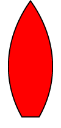
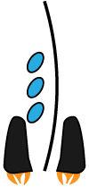

# Modding
Subluminal has basic modding support. It works by loading in alternative resources at start. The following aspects of the game can be changed:

- Mothership graphic
- Fleet graphic
- Star names

## How to
The enable mods, create a directory or zip-file named ``mods`` in the same folder the **Subluminal** jar is located.
Use the following structure to place your mods. The file names must be unique, or only the last file will be loaded into the game.

```
.
|-- Subluminal-5.0.0.jar
|
|-- config/
|---- mods/
|------ mothership/
|-------- shipBody_<name1>.png
|-------- shipDetail_<name1>.png
|-------- ...
|
|------ fleet/
|-------- fleetBody_<name1>.png
|-------- fleetDetails_<name1>.png
|-------- ...
|
|------ stars/
|-------- stars-<name1>.txt
|-------- ...
|
|------ chatbots/
|-------- chatbot1.js
|-------- ...
```
## Mothership
    

User the illustrator file in [../assets/models/ship_v1.ai](../assets/models/ship_v1.ai) as template. You need to export both layers separately. See [Export Settings](#-graphics-export-settings).

## Fleet
  

User the illustrator file in [../assets/models/ship_v1.ai](../assets/models/fleet_v1.ai) as template. You need to export both layers separately. See [Export Settings](#-graphics-export-settings).

## Star names
The content of a star name file consists of two part, the weight and the names themselves. Place an ``integer`` to be used as the weight on the first line of the file. The higher the number relative to all other weights, the more likely you will see star names from this file. Then place every star name on a separate line. Make sure the file is saved with UTF-8 encoding. You can use [../assets/other/starlist/nearest-stars.txt](../assets/other/starlist/nearest-stars.txt) as a template.

```
# Default weights of bundled starlist:
nearest-start.txt   # 999
star-wars.txt       # 99
star-trek.txt       # 99
rare-stars.txt      # 1
```

## Chatbots
Bots are written in JavaScript and parsed by the Nashorn engine. Place them into the ``config/mods/chatbot`` directory and they will get picked up by the game. Call the bot from the chat window with the ``>`` followed by its name.