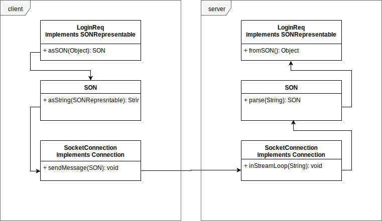

# Network protocol
Our implementation of a network protocol is stronglly influenced by JSON. The packets are constructed like objects - before sending all whitespace is removed and the keys and values are concatonated.

## Protocol properties
- The packet preamble contains only the type.
- A packet is terminated by the newline character ``\r\n``.
- Package length/size is not calculated and transmitted.
- Between preamble and message content there is a ``space`` as delimiter.
- Object notation: 
  - Objects: ``{ }``
  - Lists: ``[ ]``
  - Key/Value delimiter: ``:``
  - Field separator: ``,``

## Protocol message structure
The following package types are implemented: loginreq, loginres, logoutreq, chatmessagein, chatmessageout, ping, pong, usernamereq, usernameres

### LoginReq
***Client***: Register a new user to the server. Expects response with ``LoginRes`` object.

fields
```
{
  "username":s"<String>"
}
```

### LoginRes
***Server***: Confirms login and returns ``userid``.

fields
```
{
  "userid":i"<integer>",
  "username":s"<String>"
}
```

### LogoutReq
***Client***: Properly disconnects the client from the server.

fields
```
{
 //empty object
}
```

### ChatMessageOut
***Client***: Send ``message`` to server. ``message`` and  ``global`` are handled by the server.

fields
```
{
  "message":s"<String>",
  "receiverID":s"<String>",
  "global":b"<boolean>"
}
```

### ChatMessageIn
***Server***: Send ``message`` to client.

fields
```
{
  "message":s"<String>",
  "username":s"<String>",
  "channel":s"<String>"
}
```

### Ping
***Server***: Initiate ping/pong.

fields
```
{
  "id":s"<String>"
}
```

### Pong
***Client***: Respond to ping with pong.

fields
```
{
  "id":s"<String>"
}
```

### UsernameReq
***Client***: Send request to change the ``username``. Expects response with ``UsernameRes`` object.

fields
```
{
  "username":s"<String>"
}
```

### UsernameRes
***Server***: Sends new ``username`` to client.

fields
```
{
  "username":s"<String>"
}
```

## Diagram
