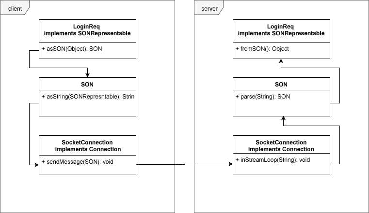

# Network protocol
Our implementation of a network protocol is strongly influenced by JSON, now called SON (**S**ubluminal **O**bject **N**otation). The packets are constructed like objects. Before sending all, whitespace is removed and the keys and values are concatenated with their respective delimiters. The only whitespace remaining is a single space between package type and message content.

## Supported commands
### /changename
***Client***: Sets new username.
``/changename <new username>``

### /logout
***Client***: Closes your connection to the server and exits the client.
``/logout`` (no arguments)


## Protocol properties
- Package length/size is not calculated and transmitted.
- The packet preamble contains only the its type.
- Between preamble and message content, there is a single ``space`` as delimiter.
- A packet is terminated by the newline character ``\r\n``.
- Object notation: 
  - Objects: ``{ }``
  - Lists: ``[ ]``
  - Key/Value delimiter: ``:``
  - Field separator: ``,``


## Protocol message structure
Each message can contain zero or more values of the following java variable type: ``boolean (b)``, ``integer (i)``, ``double (d)``, ``String (s)``, ``list<SON> (l)``. The key is always a string enclosed in quotes (parsing help), the value is a string representation of its original value enclosed in quotes (parsing help), prepended with a char to represent its original type for later parsing. The list type is not yet working (required to send multiple values of the same type of more importantly to send other SON objects). The following package types are already implemented and in use: 

### LoginReq
***Client***: Register a new user to the server. Expects response with ``LoginRes`` object.

```
loginreq {
  "username":s"<String>"
}
```

### LoginRes
***Server***: Confirms login and returns ``userid``.

```
loginres {
  "userid":i"<integer>",
  "username":s"<String>"
}
```

### LogoutReq
***Client***: Properly disconnects the client from the server.

```
logoutreq {
 //empty object
}
```

### ChatMessageOut
***Client***: Send ``message`` to server. ``message`` and  ``global`` are handled by the server.

```
chatmessageout {
  "message":s"<String>",
  "receiverID":s"<String>",
  "global":b<boolean>
}
```

### ChatMessageIn
***Server***: Send ``message`` to client.

```
chatmassagein {
  "message":s"<String>",
  "username":s"<String>",
  "channel":s"<String>"
}
```

### Ping
***Server & Client***: Initiate ping/pong. Expects response with ``Pong`` object.

```
ping {
  "id":s"<String>"
}
```

### Pong
***Server & Client***: Respond to ping with pong.

```
pong {
  "id":s"<String>"
}
```

### UsernameReq
***Client***: Send request to change the ``username``. Expects response with ``UsernameRes`` object.

```
usernamereq {
  "username":s"<String>"
}
```

### UsernameRes
***Server***: Sends new ``username`` to client.

```
usernameres {
  "username":s"<String>"
}
```

## Diagram
  
Example: Sending a ``LoginReq`` message from client to server. 