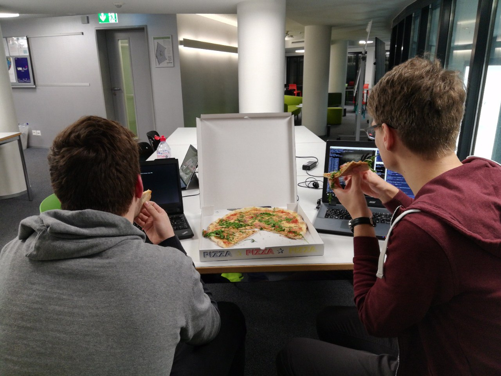
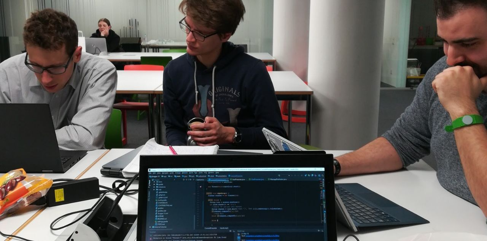
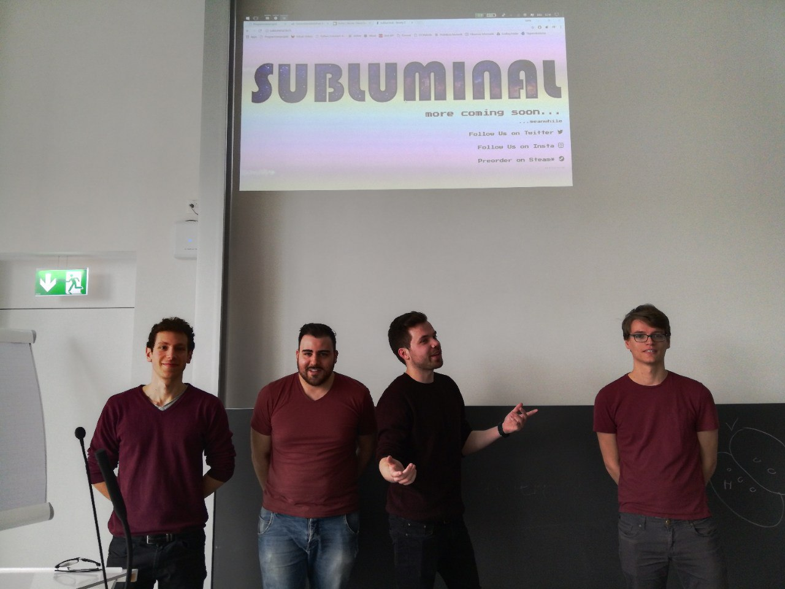


# Project Diary

**DAV** = David Lengweiler  
**LGK** = Lucas Galery Käser  
**LUC** = Luc Kury  
**RIK** = Rik de Graaff  

### Thursday, March 29th, 2018 (DAV, LGK, LUC)
##### Decisions:
- Justified master merges are now allowed anytime. Issue templates for example need to be in the master branch to be detected correctly. However, direct merges of source code into the master branch are still forbidden.
- Current to do's are:  
  - to fix the NetCat-Situation of M2 (to be specified)
  - to fix the faulty parsing of double quotes in strings
  - to improve the reaction logic of the server when it doesn't get the client's pong message anymore
  - to overwork the QA plan: instead of the latency time we want to track the client and server tick rates and achieve certain rates (which yet are to be set)
- Log4J and Mockito are external libraries we are going to use until M3
### Sunday, March 25th, 2018 (DAV, LGK, LUC)
- Logout functionality implementation was finished.
- Protocol document was created.
- Source code documentation was updated.

### Friday, March 23rd, 2018 (DAV, LUC, RIK)
- DAV created a syntax for all "/"-commands for console messages.
- SON parsing functionality was implemented.
- Ping manager was implemented.
- Name change functionality was implemented.
- Logout functionality was starting to be implemented.
 

### Thursday, March 22nd, 2018 (all)
- Added feature: When you prepend "/" or "@" to your command-line message you can add functionality to it, for example "/logout", or "@alex02". These changes were made in ConsolePresenter.java. 

### Wednesday, March 21st, 2018 (all)
- Long coding evening, implementing all methods of the SON.java class, the network chat functionality and the client-side chat presentation.
- Our tutor Marco recommended us to take better care of our diary.


### Sunday, March 18th, 2018 (all)
We spent half a day implementing the first classes and interfaces.

### Wednesday, March 14th, 2018 (all)
##### Decisions/ideas:
- Our code style is going to be the Google Java code style.
- We specified the package structure for the project (in the app folder).
The structure is as follows:  

```
src
|
|__main   
     |
     |__java  
         |
         |__tech.subluminal
             |
             |__client
             |   |
             |   |__init
             |   |
             |   |__logic   
             |   | 
             |   |__presentation
             |   |
             |   |__stores
             |
             |__shared 
                 |
                 |__messages
                 |
                 |__net
                 |
                 |__records
                 |
                 |__son
                       
```

### Sunday, March 11th, 2018 (all)
After some discussion within the group and consulting the tutors, we decided to use our own implementation of the JSON format. We named it SON (**S**ubluminal **O**bject **N**otation). This format will be used to generalize the network communication between the client and the server. It is designed as an interface and thus allows us to parse any Java object into a transferable object.

### Thursday, March 9th, 2018 (all)


### Monday, March 5th, 2018 (all)
##### Decisions/ideas:
In this meeting we decided about most of the rules of our game. They are:
##### _Rules_
- Possibly 2-n players, for the moment we decided the maximum number of players will be 8.
- At the beginning of a game, the map is created randomly.
- You lose the game when your mother ship does not exist anymore.
- You win the game when your mother ship is the only remaining mother ship on the map.
- Starting positions of the players are assigned randomly, but in a way no player has a big advantage or disadvantage.
- Every player is able to see the whole map.
- The map consists of stars, which also are solar systems. At the beginning of a game every player's mother ship is randomly assigned to a star.
- Each star has its own attributes, which influence:  
	a) The frequency of production of new regular ships.
	b) The basic defense of a star against intruders.
	c) How much effort it takes to colonize the star.
- If a player colonizes a new star, the star automatically starts producing regular ships for the player, which are local to that star.
- The regular ships that are local to a star that is owned by a player can be sent out by the player.
- Every order to move regular ships from one star to another originate from the mother ship.
- Each star also has an attribute that regulates the maximum radius a ship can reach without having to fuel up on another star.
- The rule above implicates	that further destinations can only be reached by one's regular ships by "hopping" from star to star to be able to fuel up.
- "Hopping" can occur on both neutral and owned (colonized) stars.
- By hopping onto a star that is owned by an opponent, the hopping player gets punished by automatic tear-down of a certain percentage of his hopping ships.
- If a player targets a certain star he or she can influence the hopping path his or her ships or use the one that is automatically calculated by the system, which is the shortest.
- Hopping stars and colonizing stars are two separate processes. Accidental colonization while hopping a star can not occur.
- When regular ships reach the target they hopped to, two scenarios can happen:
	a) Nobody is there yet, the star is neutral. The player's regular ships start colonizing the star. The speed of the colonization progress depends from the number of regular ships the player sent, the basic defense of the star and how much effort the star takes to be colonized.
	b) The star is already under possession of an opponent. In this case the fleets of the opponents start tearing down themselves, until only regular ships of one of the fleets remain. If the remaining regular ships belong to the intruder, they immediately start neutralizing the star to then colonize it. If the remaining regular ships belong to the previous owner of the star, nothing else happens.
- Every move one's regular ships make originates from the mother ship. Thus, the order takes longer to get to the concerning regular ships, the further their base star is away from the mother ship.
- When a player orders a fleet to go colonize another star, the information about the number of available regular ships is always outdated (because of the distance). So the player has to options:
	a) He/She sends out the order that a certain percentage of the regular ships should leave their base star.
	b) He/She sends out the order that a certain number or regular ships should be the maximum number of sent out ships. If there are not that many regular ships left the moment the order arrives at the base, all regular ships are sent out.
- Fleets of regular ships that are hopping to their target send out information to their mother ship about their position in regular intervals.
- The mother ship can also be moved from her base, it's slower than the regular ships.
- The mother ship has an own basic defense value.
- If the base of the mother ship is intruded, the mother ship is the last one to be torn down.
- Every mother ship and every regular ship broadcast their position so that every player can see it.

## Sunday, March 4th, 2018 (DAV, LUC, LGK)
##### Decisions/ideas:
- The language for all documents concerning the programming project will be English
- The game concept will be concreted on Monday, March 5th
- On Monday we will also make a final decision if the game is going to be round-based or in real time

##### Task division
LUC: Definition of our software requirements for the project; brainstorming/design of our repository and branch structure and of our IntelliJ configuration  
DAV: Setup of a rudimentary merchandise website as a gag for the first milestone

### Friday, March 2nd, 2018 (RIK, DAV, LGK)
##### Decisions/ideas:
- **Ideas for game names**: Ether, Far Away, Separation, Delay, Subluminal
- **Team name**: Bordeaux Ink.
- **Basic game principle**: The game happens on an outer space map with stars. In the beginning every player has his main ship placed in a random planet system and produces his fleet of smaller ships with the resources that his planets offer. The goal is to conquer the biggest number of planet systems. The players can inform themselves about the position of their adversaries and in which state of colonization other planet systems are by sending out requests. The twist is that the messenger ships take some time to get to their target and back, so when they are back the information is already not the latest anymore and the player has to make decisions upon outdated information.

##### Task division:  
DAV: Mock-ups; graphical sketches  
RIK: Division client/server; definition of the network protocol  
LGK: Planning of the presentation; definition of the style and structure of upcoming presentations  
LUC: (Create a git-repository;) Planning of the structure of the git-repository; decision if we should use the IntelliJ-plugin for git