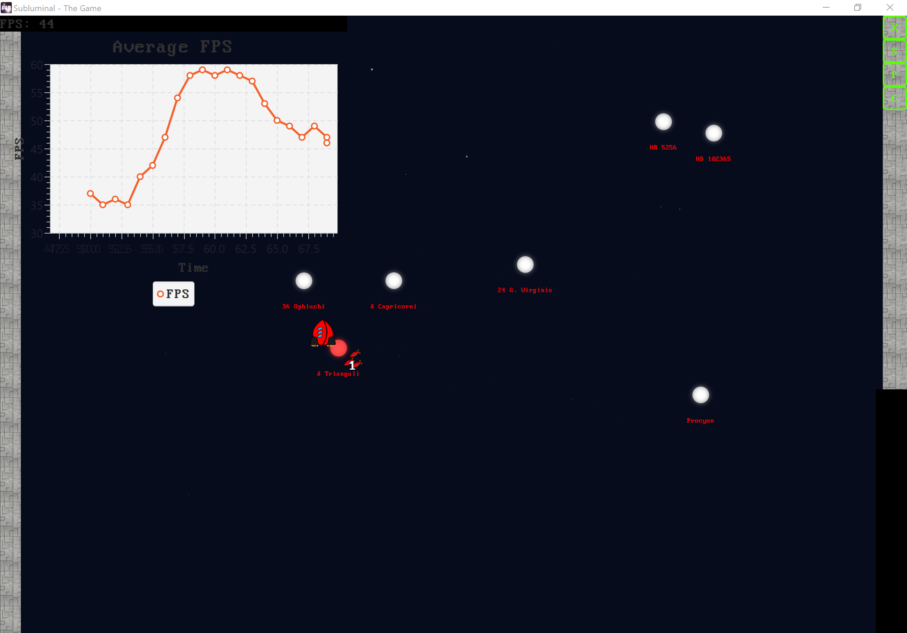
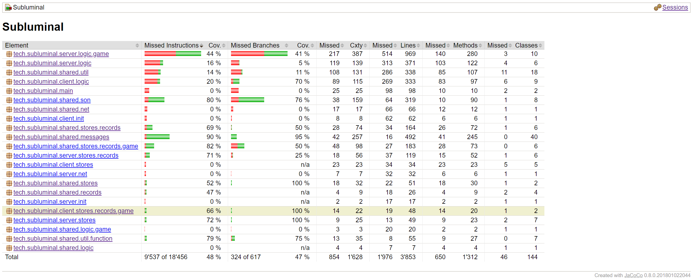
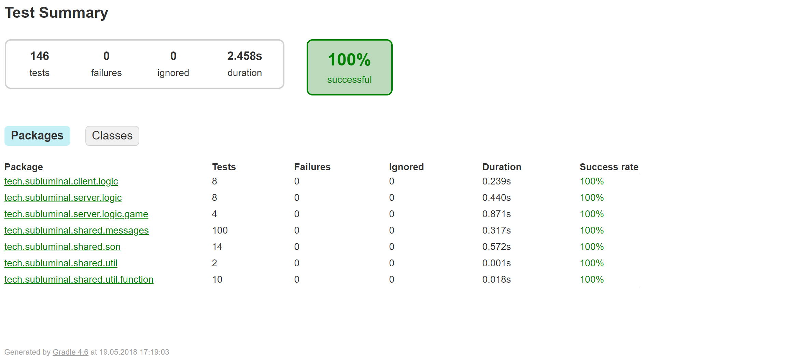

# Quality assurance concept

## Basics
1. Branching model (git-flow)
2. Issues and merge requests
3. Code style guides using [Google CodeStyle][1], enforced with gradle task and IntelliJ.  
4. Unit tests with JUnit and Mockito
5. Code metrics (test coverage via jacoco)
6. Play testing (functionality is tested by team on different physical machines)
7. Automatic testing  
  7.1 Continuous integration  
  7.2  Continuous deployment (via Docker -> [Image][2])

## Workflow
1. After a release, pull the ``master`` branch back into ``dev`` to get the latest hotfixes.
2. Create your new feature branch from ``dev``.
3. Once you're done, create a merge request from your feature branch in to ``dev``.
4. Assign a colleague to review your code and complete the merge request.
5. Once all features for the next version are done, create a new ``release`` branch.
6. Then you need to update the version number, docs, write the changelog, play test, check the staging environment for bugs, etc.
7. Lastly, merge the ``release`` branch into master and tag the commit with the version number.
8. Go back to step 1.

## Quality characteristics
### 1. Efficiency / Latency
To ensure a fluid gaming experience, the server needs to be able to compute the data inside the game loop in a certain time frame. This is called the server tickrate. We are targeting a tickrate of 10 Hz per hosted game (up to 10 games) on the server (during a 4 player average). Is the server performing normally (faster than 10 Hz), the game loop is slowed down artificially with Thread.sleep(). The resulting tickrate is logged in the server console in debug mode. Additionally, the time difference from the game loop is sent to the client and can also be displayed in its debug view.  
The chart shows a mostly stable framerate of around 45 frames per second (fps) with a fluctuation of +- 5 frames. This is sufficient for our purposes. An interesting remark: JavaFX tries to draw at a constant 60 fps, which clearly cannot be kept up with here. The server tick is artificially locked at 10 Hz, which works well, performance and gameplay wise. FPS and Tickrate are averaged over the last 100 values, then the last 20 entries are shown in the chart.  

### 2. Reliability / Error tolerance 
The software is tested with junit unit tests. For the more intricate tests, the mockito framework was used to construct mock classes and simulate network connections. As a metric we use the code coverage percentage (``"degree to which the source code of a program is executed when a particular test suite runs".`` [Wikipedia][6]).  
The goal is to achieve a coverage of **35 %** (excluding gui packages). Currently, there are 146 unit tests and we are at **48 %** coverage, GUI packages excluded (May 19th, 2018). Some of the unit tests helped us finding a few logic flaws in our code and others helped us building some trust in our message parsing system.

  

## Merge requirements

| Branch            | Merge target          | Merge requirements          | Deployed to        |
| :---------------- | :-------------------- | :-------------------------  | :----------------- |
| ``master``    :   | -                     | -                           | [Production][3]    |
| ``release`` :     | ``️master``            | ✔️ Tests, ✔️ Build, ✔️ Doc    | [Staging][4]       |
| ``hotfix`` :      | ``release, master``   | ✔️ Tests, ✔️ Build, ✔️ Doc    | -                  |
| ``dev``       :   | ``release``           | ✔️ Tests, ✔️ Build, ✔️ Doc    | [Development][5]   |
| ``feature`` :     | ``dev``               | ✔️ Tests, ❌ Build, ❌ Doc   | -                  |

[1]: https://github.com/google/styleguide/blob/gh-pages/intellij-java-google-style.xml
[2]: https://hub.docker.com/u/subluminalthegame/
[3]: subluminal.tech:1790
[4]: staging.subluminal.tech:1790
[5]: dev.subluminal.tech:1790
[6]: https://en.wikipedia.org/w/index.php?title=Code_coverage&oldid=831669504
 